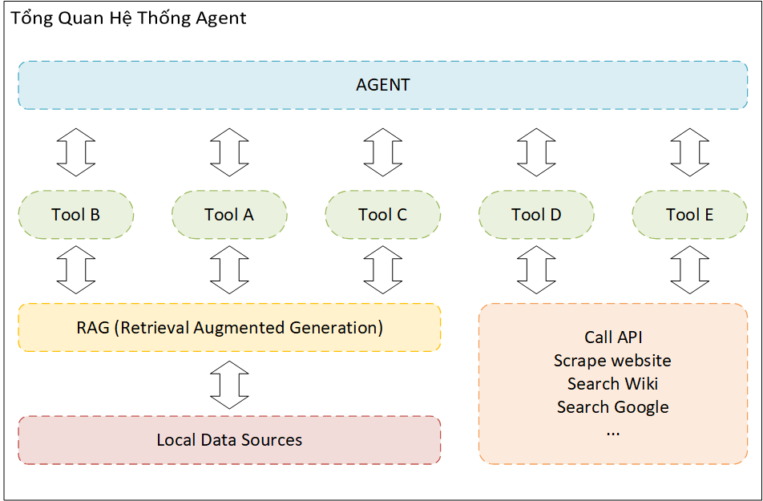
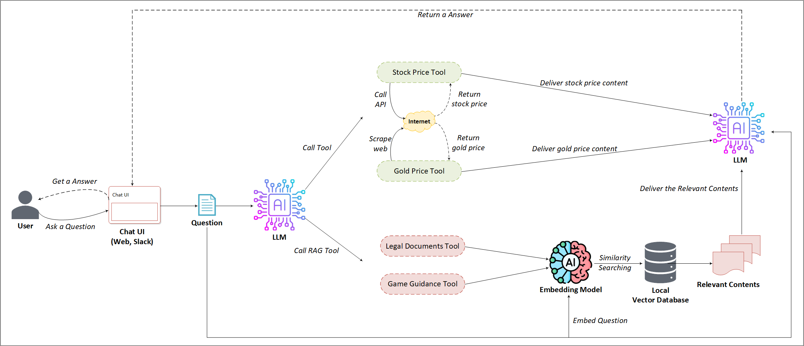
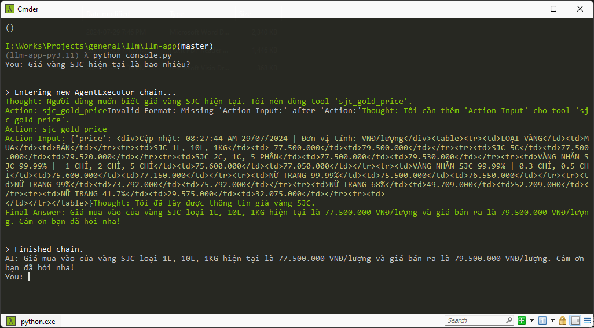
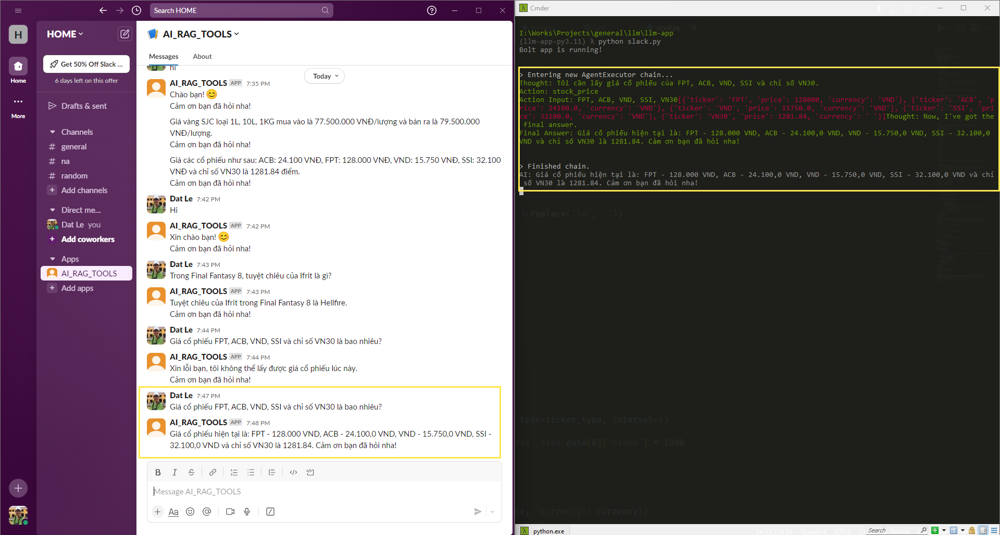
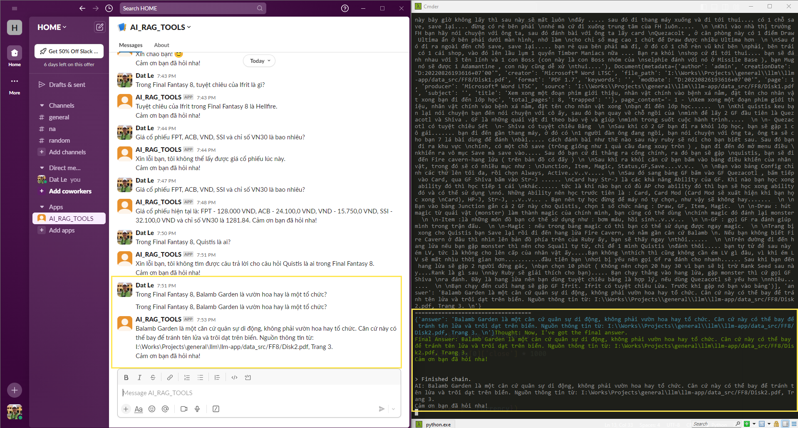
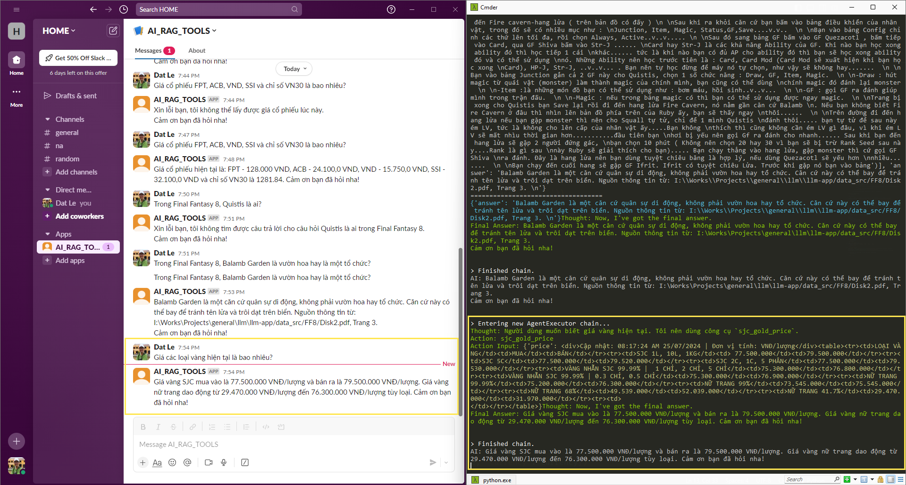
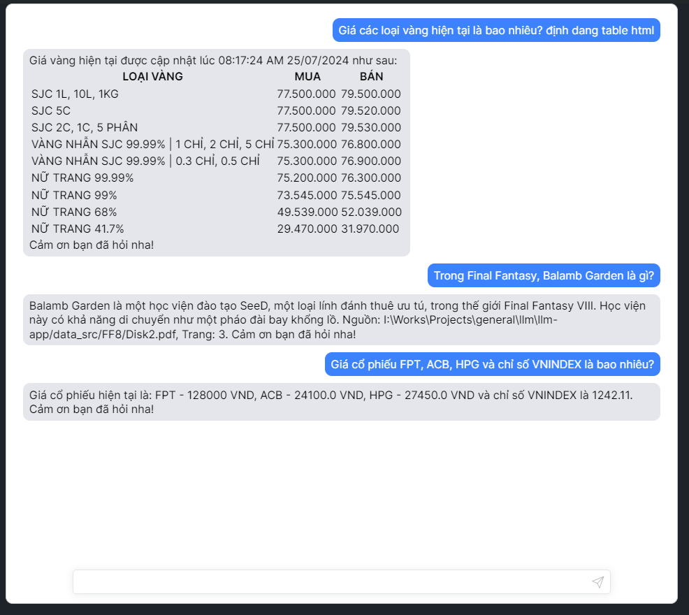

<h1 style="text-align: center;">

DEMO

HỆ THỐNG AGENT (LANGCHAIN) 

KẾT HỢP MÔ HÌNH NGÔN NGỮ LỚN (LLM) VÀ RAG (RETRIEVAL AUGMENTED GENERATION) ĐỂ TRUY XUẤT DỮ LIỆU
</h1>

## I. Tổng quan

## II. Sơ đồ workflow 

## III. Một số hình ảnh demo:

### 1. Sử dụng Console:

### 2. Sử dụng Slack làm Chat UI:

### 3. Sử dụng Web Chat UI:

